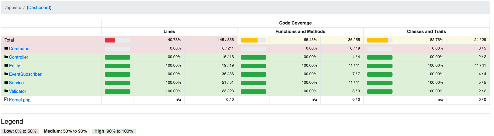

# csv-processor

## How to run

1. Make sure you have docker and docker-compose installed and run.
2. Run `make init` in order to build and start an application.
3. Now you have several options to use application:
   1. API could be accessed on http://localhost:8080:
      1. `POST api/v1/csv/processor`. E.g.:
      ```curl
      curl --location 'http://127.0.0.1:8080/api/v1/csv/processor' \
      --form 'csv_file=@"samples/csv/test_csv_1000_records_1709942325.csv"'
      ```
      2. or with additional options:
      ```curl
      curl --location 'http://127.0.0.1:8080/api/v1/csv/processor' \
      --form 'csv_file=@"samples/csv/test_csv_1000_records_1709942325.csv"' \
      --form 'delimiter=","' \
      --form 'enclosure="`"' \
      --form 'escape="@"'
      ```
      3. or with additional options:
      ```curl
      curl --location 'http://127.0.0.1:8080/api/v1/csv/processor' \
      --form 'csv_file=@"samples/csv/test_csv_10000_records_1709942370_invalid.csv"'
      ```
      4. or with Postman through `Content-Type: multipart/form-data` and `key` = `csv_file`, `value` = `needed file`.
   2. Console command to process CSV file is `make csv-process path=path/to/file.csv` (use relative path). E.g. `make csv-process path=samples/csv/test_csv_1000_records_1709942325.csv`).
   3. Also, you can pass additional options to manipulate CSV parsing. E.g. changing delimiter and others `make csv-process path=samples/csv/test_csv_1000_records_1709942325.csv "options=--delimiter=: --enclosure=# --escape=@"`
4. API will respond:
   1. If successfully processed and validate CSV - with `200 OK` and [success response](/samples/api/response/success_response_example.json).
   2. If failed to validate CSV file itself - with `422 Unprocessable Content` and [unsuccessful response](/samples/api/response/validation_single_error_response_example.json).
   3. If unsuccessfully processed and/or failed to validate CSV content - with `422 Unprocessable Content` and [unsuccessful response](/samples/api/response/validation_list_error_response_example.json).
   4. If something went wrong while processing CSV file - with `400 Bad Request` and [unsuccessful response](/samples/api/response/bad_request_error_response_example.json).

## System design


## Testing

- In order to run all tests run `make test`.
- In order to run only unit tests run `make test-unit`.
- To see test coverage run `make test-unit-coverage` and then open `var/coverage/index.html`
- To use more complex command you can just get inside container `make sh c=csv-processor-php-fpm` and do your stuff.

### Test coverage


## Samples
- You can find several validation errors' response examples [here](samples/api/response).
- You can find different csv file examples [here](samples/csv).
- You can generate your own CSV files for test purpose by running `make csv-generate path=path/to/folder/`. E.g `make csv-generate path=samples/`.
- Also, you can pass additional options to manipulate CSV generating. E.g. setting amount of rows to generate, delimiter and others `make csv-generate path=samples/ "options=-N 250000 --delimiter=: --enclosure=# --escape=@"`

## Notes

I've made several assumptions about how this exact application could behave. Some of them are described in [System Design section](#system-design) and below: 
- For test purpose max file size was set (both on nginx and php side) to `256 Mb` for API calls. No limitations for cli tho.
- Console command was tested against several different CSV files:
  - 1000 rows, `0.66 Mb`: it takes ~ `18.00 MiB` and `0.7 sec` to process;
  - 10000 rows, `6.6 Mb`: it takes ~ `18.00 MiB` and `4.8 sec` to process;
  - 100000 rows, `66.6 Mb`: it takes ~ `18.00 MiB` and `48.6 sec` seconds to process;
  - 1000000 rows, `669.2 Mb`: it takes ~ `18.00 MiB` and `8.12 min` seconds to process;
- API call was tested against several different CSV files:
  - 1000 rows, `0.66 Mb`: it takes ~ `2.59 s sec` to process;
  - 10000 rows, `6.6 Mb`: it takes ~ `6.52 s sec` to process;
  - 100000 rows, `66.6 Mb`: it takes ~ `53.4 sec` seconds to process;
  - 380000 rows, `254.1 Mb`: it takes ~ `2 min 56 sec` seconds to process;
- There are several ways how to store and use CSV scheme. It could be a config file, classes or even a CSV file to compare to.
Fot this task I've decided to stick with simple PHP class (`App\Entity\Product`) and define CSV headers, scheme and validation rules at one place.
- `App\Service\CsvProcessor` was packed with wide range of public methods in order to support different entry points:
  - API call with sync processing;
  - API call with async processing;
  - console command run;
  - any other potential entry points.
- Using `ConstraintViolationListNormalizer` to generate the list of validation errors based on the [RFC 7807](https://datatracker.ietf.org/doc/html/rfc7807) specification.
  If customization is needed there are several options:
    - by passing a custom `Normalizer` to `Serializer` object;
    - by throwing custom `CsvValidationException` and catching it with `KernelEvents` (as it was done for `App\Controller\Api\Formatter\ConstraintViolationFormatter`);
    - by reacting to `KernelEvents::RESPONSE` event and modifying response.
- Several "service" interfaces were added (at the 1st thought redundant) to move to abstraction usage rather than realization and for potential future usage when we could have different processing behaviour.
This also helped to separate business logic and tests.

- Possible optimizations:
    - Instead of using `League\Csv\Reader::getRecordsAsObject` to read and hydrate a record at once, we can use `League\Csv\Reader::getRecords` to get an array and map/validate it manually.
      This will decrease memory usage from not creating additional objects at a price of convenience.
    - Adding message broker (e.g. RabbitMq) will help speed up parsing through paralleling processing.
      `App\Service\CsvProcessor::processRecord` has been already made for this purpose.
    - Processing through message broker could be done with ETL approach. This will help to greatly speed up things and support complex CSV-entity schemas.
    - In order to support more CSV schemas `App\Entity\Product` could be extended with an additional logic of a list of supported entities/schemas.
    - Validation errors' handling in `App\Controller\Api\V1\CsvProcessorController::process` could be merged into `App\EventSubscriber\Api\Formatter\DomainExceptionFormatter::onKernelException`.
  Left it in controller to show possible different approaches.
    - Header errors' handling in `App\Controller\Api\V1\CsvProcessorController::getHeaders` could be merged into main violation error list by throwing `CsvRecordUnSuccessfulProcessingException`.
  Left it as it is to show another approach with state manipulation and error handling through Domain exceptions and `400 HTTP error code`.
    - OpenApi API doc, CI/CD, linters could be added as well for a convenience.

## Troubleshooting

- If you have an error 
```
xcrun: error: invalid active developer path (/Library/Developer/CommandLineTools), missing xcrun at: /Library/Developer/CommandLineTools/usr/bin/xcrun
```
while running `make` command - you [need to install](https://apple.stackexchange.com/questions/254380/why-am-i-getting-an-invalid-active-developer-path-when-attempting-to-use-git-a) the `Xcode Command Line Tools` (run `xcode-select --install`) or reset it if has been already done (run `xcode-select --reset`).